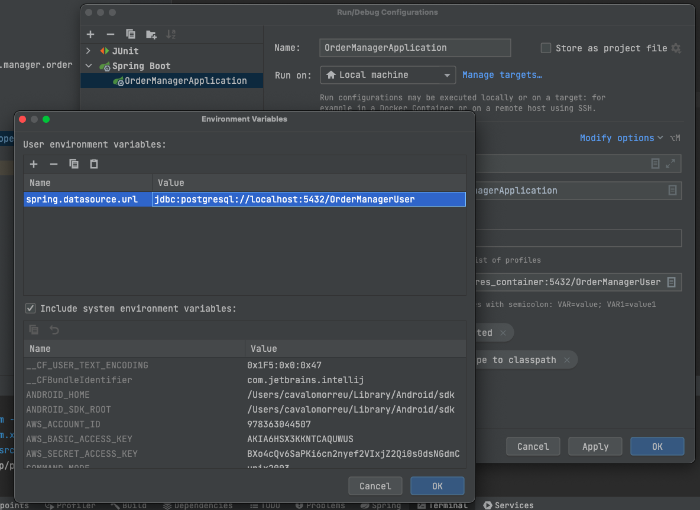

# Getting Started

## Start project

```
docker-compose up -d postgres
docker-compose up -d pgadmin
docker-compose up --build -d springboot
```

## Generate resources
```
mvn generate-resources
```

## Documentation

### Via IDE port: 8080
http://localhost:8080/swagger-ui.html#/

### Via Docker port: 8000

http://localhost:8000/swagger-ui.html#/


### Config ENVs IDE Intellj

```
spring.datasource.url=jdbc:postgresql://localhost:5432/OrderManagerUser
```




### Reference Documentation

For further reference, please consider the following sections:

* [Official Apache Maven documentation](https://maven.apache.org/guides/index.html)
* [Spring Boot Maven Plugin Reference Guide](https://docs.spring.io/spring-boot/docs/2.7.1/maven-plugin/reference/html/)
* [Create an OCI image](https://docs.spring.io/spring-boot/docs/2.7.1/maven-plugin/reference/html/#build-image)
* [Spring Web](https://docs.spring.io/spring-boot/docs/2.7.1/reference/htmlsingle/#web)
* [Spring Data JPA](https://docs.spring.io/spring-boot/docs/2.7.1/reference/htmlsingle/#data.sql.jpa-and-spring-data)

### Guides

The following guides illustrate how to use some features concretely:

* [Building a RESTful Web Service](https://spring.io/guides/gs/rest-service/)
* [Serving Web Content with Spring MVC](https://spring.io/guides/gs/serving-web-content/)
* [Building REST services with Spring](https://spring.io/guides/tutorials/rest/)
* [Accessing Data with JPA](https://spring.io/guides/gs/accessing-data-jpa/)

